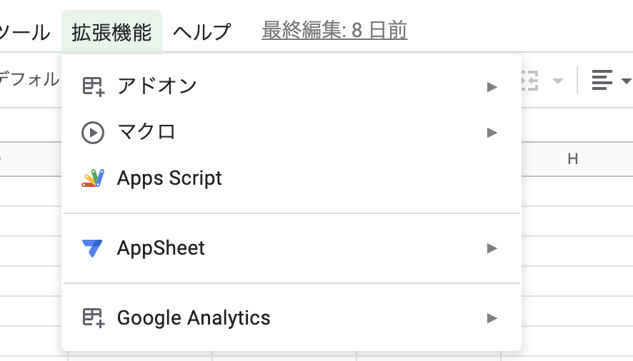
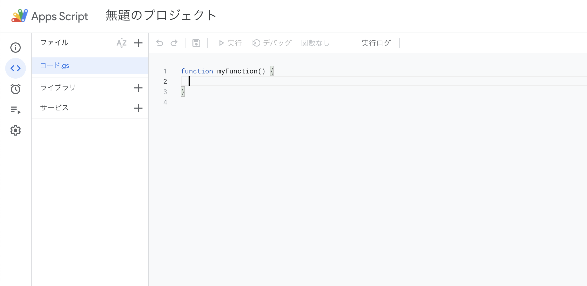
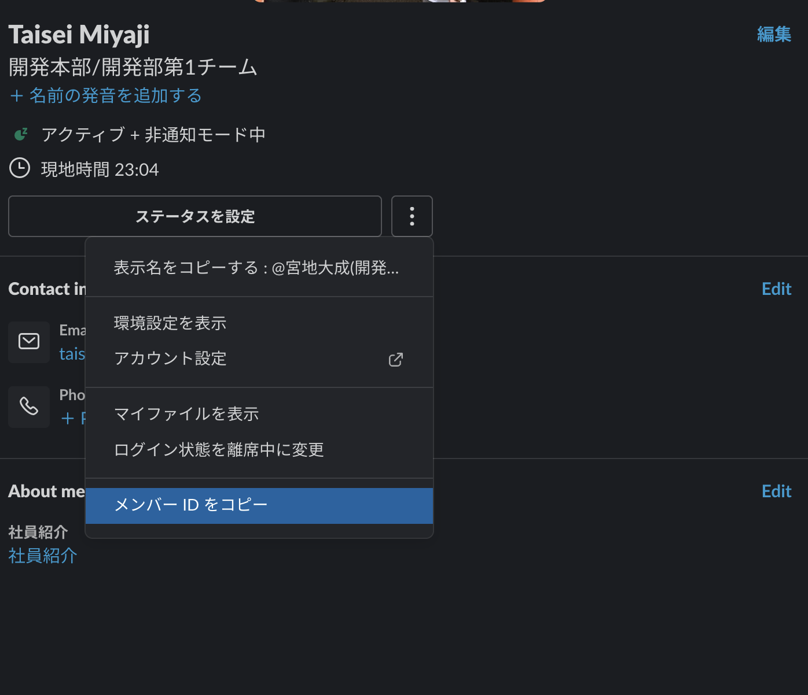
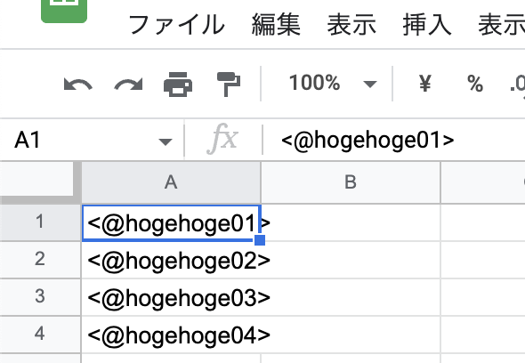
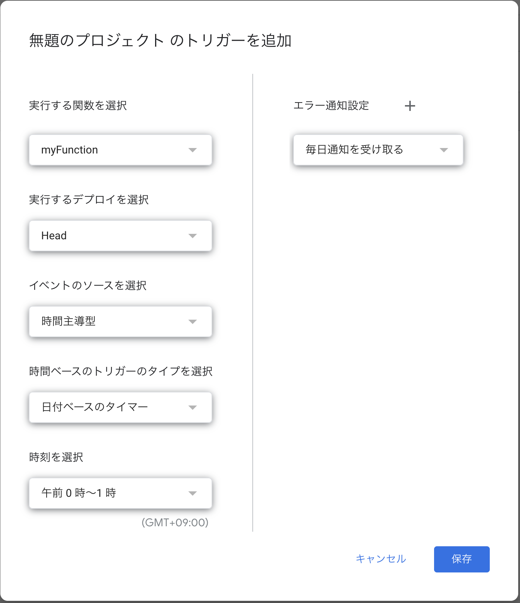

# GASでランダムに司会を決定するSlackBotを作った話

---

## 作成した背景
- チーム内で終礼やチームMTGの司会のローテーションをしている
- 順番ではなくランダムにしておくと覚えておかなくて良い
- 終礼等slackのハドルを使う機会が多いためslack上で実現したい
- slackのワークフローではランダム機能は実現できない

---

## GASを選択した理由
- Googleドライブ上で共有しやすい
- 作成に時間をかけたくない
- トリガーの時間指定ができる

---

## 利用したライブラリ
https://github.com/soundTricker/SlackApp

作者のQiita記事
https://qiita.com/soundTricker/items/43267609a870fc9c7453

- 基本的に`SlackApp`ライブラリはSlackAPIと同じメソッド名で実装されている。

---

## ライブラリ使用上の注意点

GASでライブラリを公開するためのキーとして、
- プロジェクトキー
- スクリプトID
の2種類がある。

->GASのIDEの更新によって、ライブラリの追加に使用できるのはスクリプトIDのみになった。

公式
https://developers.google.com/apps-script/guides/libraries

---

## 作成の流れ
  


---

  

---

## slackにメッセージを投稿するために必要な情報

- token: slackのアクセストークン
- channelId: チャンネルID
- userName: 投稿するBotの名前

---

## トークンの取得について

Slackアプリ導入申請が必要ですので割愛します

---

## チャンネルIDについて

チャンネルを右クリックして「チャンネル詳細を表示する」をクリックするとIDを確認できます
ちなみにユーザーごとにもIDが振られています
これをチャンネルIDとして指定するとDMになります

---

  


---

# 実際にコードを書いてみる

---

ランダムを実現するためにシートに対象となるメンバーのIDを用意します。
この形式で書くことでメンションが当たります。
  

---
コードからシートの情報へのアクセスにはIDが必要
```JS
var sheet = SpreadsheetApp.openById("スプレッドシートID").getActiveSheet()
```
スプレッドシートIDとは
```
https://docs.google.com/spreadsheets/d/スプレッドシートID/edit#gid=0
```
---

シートが取得できたので中身を取得します。
```JS
var lastrow = sheet.getLastRow();
var lastcol = sheet.getLastColumn();
var sheetdata = sheet.getSheetValues(1, 1, lastrow, lastcol);
```
※sheet.getSheetValues([開始行], [開始列], [行数], [列数])のように指定します。

---
ランダムに数値を出力するアルゴリズム
```JS
function getRandomInt(min, max) {
  min = Math.ceil(min);
  max = Math.floor(max);
  return Math.floor(Math.random() * (max - min) + min); //The maximum is exclusive and the minimum is inclusive
}
```
---
あとは行を計算してslackAppのメソッドに渡すだけ!
```JS
  var row = getRandomInt(RANDOM_MIN, RANDOM_MAX + 1);
  var Name = sheetdata[row];
  var Message = "今日の司会は" + Name + "さんです。よろしくお願いします。";
  var slackApp = SlackApp.create(slack["token"]);
  slackApp.postMessage(slack["channelId"], Message, {username : slack["userName"]});
```
注意点: シート行番号は1オリジンだが、配列は0オリジンであることに注意する。

---

# 作ってよかったこと
- 普通に便利
- 作成に要した時間も1hくらいだったのでお手軽
- 後から追加したいルールにも簡単に対応できる
  (決まった曜日に特定のメンバーを外すとか)

---

# 改善の余地
- トリガーする時間の指定が1時間幅でしか指定できない(GASの仕様)
- チャンネルへメンションを当てることができていない

---
  

---

# まとめ
- 小規模なものであれば時間をかけずに便利なものを作りやすい
- 非エンジニアでも簡単に始められる

---
### コードサンプル

```JS
var slack = {
  token: 'トークン',
  channelId: 'チャンネルID'
  userName: "ランダム司会Bot",
}
const SATURDAY = 6;
const SUNDAY = 0;
const MONDAY = 1;

const RANDOM_MIN = 1;
const RANDOM_MAX = 4;
var sheet = SpreadsheetApp.openById("スプレッドシートID").getActiveSheet();
var lastrow = sheet.getLastRow();
var lastcol = sheet.getLastColumn();
var sheetdata = sheet.getSheetValues(1, 1, lastrow, lastcol);

function RANDOMBOT() {
  var today = new Date();
  if(today.getDay() == SUNDAY || today.getDay() == SATURDAY){
    return;
  }
  var row = getRandomInt(RANDOM_MIN, RANDOM_MAX + 1);

  Logger.log(row);
  var Name = sheetdata[row];
  var Message = "今日の司会は…" + Name + "さんです。よろしくお願いします。";
  if(today.getDay() === MONDAY){
    Message = Message + "\n本日の定例会の議事も合わせてお願いします。"
  }
  var slackApp = SlackApp.create(slack["token"]);
  slackApp.postMessage(slack["channelId"], Message, {username : slack["userName"]});
}

function getRandomInt(min, max) {
  min = Math.ceil(min);
  max = Math.floor(max);
  return Math.floor(Math.random() * (max - min) + min); //The maximum is exclusive and the minimum is inclusive
}
```
